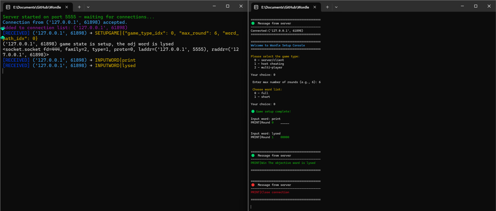
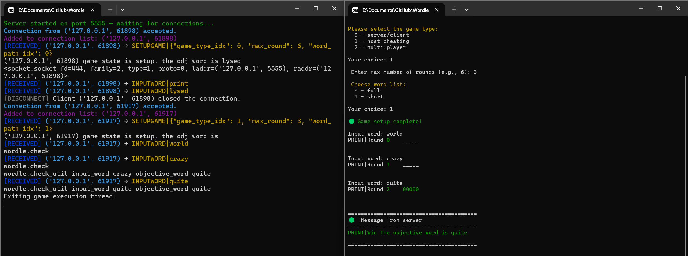
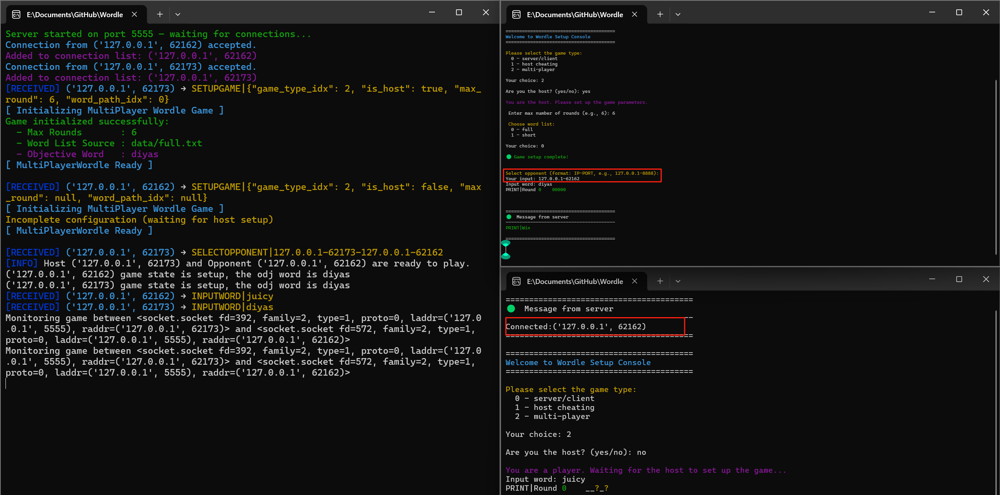

# Wordle Multiplayer Game (Python Console Edition)

A multiplayer-ready version of the Wordle game built using Python sockets. It supports three gameplay modes and client-server communication through TCP sockets.

## Project Structure

```
wordle/
├── client.py           # Client program that connects to the server
├── server.py           # Server program that manages games and connections
├── game.py             # Defines Game class and GameFactory to instantiate games
├── wordle.py           # Implements Wordle game logic (normal, host-cheating, multiplayer)
├── connection.py       # Represents each player connection on the server side
├── data/
│   ├── full.txt        # Full word list
│   └── short.txt       # Shorter word list
├── demo/               # Screenshots or demo captures
├── dist/
│   ├── client.exe      # Windows executable for client
│   └── server.exe      # Windows executable for server
├── build/              # PyInstaller build cache
├── README.md           # Project documentation
```

## Gameplay Modes

1. **Server/Client (Normal Wordle)** — _Task 1 & Task 2_
2. **Host Cheating** — _Task 3_
3. **Multiplayer** — _Task 4_

   In Multi-Player mode, 2 players guessing the same word, while being able to monitor their opponents’
   progress.

## How it Works

### Server (`server.py`)

- Accepts incoming client connections via `socket`.
- Stores all active connections as `Connection` objects.
- Uses `GameFactory` to create appropriate `Game` instances.
- Coordinates multiplayer opponent selection and word sync.
- Sends messages via `send_msg_to_client()` and handles logic in `handle_command()`.

### Client (`client.py`)

- Connects to server and interacts through a command-based protocol.
- Sends user input such as setup, opponent selection, and guessed words.
- Receives and parses messages using `recv()` loop and `handle_command()` dispatcher.

### Commuication Protocol

| Command            | Parameters                    | Description                       |
| ------------------ | ----------------------------- | --------------------------------- |
| `SETUPGAME`        | `{JSON}`                      | Setup game with parameters        |
| `SELECTOPPONENT`   | `hostip-port-opponentip-port` | Select another client as opponent |
| `INPUTWORD`        | `<word>`                      | Submit a guessed word             |
| `REQUIREINPUTWORD` |                               | Request re-input of word          |
| `PRINT`            | `<message>`                   | Display a message                 |
| `CLOSECONNECTION`  | `<message>`                   | End client session                |

### `Game` / `ServerClientGame` / `HostCheating` / `MultiPlayer` (in `game.py`)

Manages the overall game setup, game type, wordle instance, game state, and interaction with server.

### `Wordle` / `NormalWordle` / `HostCheatingWordle` / `MultiPlayerWordle` (in `wordle.py`)

Encapsulates game rules and word scoring logic.

### `Connection` (in `connection.py`)

Represents a single client’s connection to the server

### `Server` (in `server.py`)

## Setup & Run

### Option 1: Run from Python source

Launch the server:

```bash
python server.py
```

Launch one or more clients (in separate terminals):

```bash
python client.py
```

### Option 2: Run compiled .exe (for Windows users)

Double-click:

- `dist/server.exe`
- `dist/client.exe`

These .exe files were generated using **PyInstaller** in a Windows environment (not WSL).

Make sure the `data` directory is in the same location as the `.exe` files.

```powershell
pyinstaller --onefile --name=client ^
  --add-data "data\\full.txt;data" ^
  --add-data "data\\short.txt;data" ^
  client.py

pyinstaller --onefile --name=server ^
  --add-data "data\\full.txt;data" ^
  --add-data "data\\short.txt;data" ^
  server.py
```

3. Follow the interactive prompt to:

- Select game mode, number of rounds in maximum, word list
- If it is a multi-player mode:
  - Choose role (host/player)
  - Select opponent

## Console UX

- Colored server/client console
- Colored feedback for win (green), lose (red), and partial matches (yellow).

## Example Interaction






## Feature Highlights

- Support for different game modes
- Multithreaded server-client communication
- Enhanced console with colored output
- Command history tracking
- Peer-to-peer opponent selection in multiplayer
- Provide executable software
